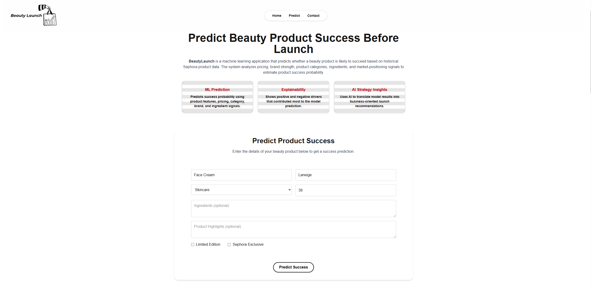
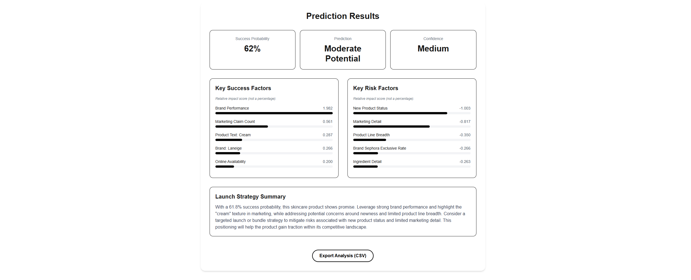
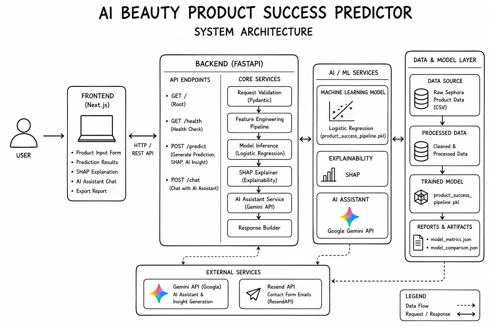

# AI Beauty Product Success Predictor

An end-to-end machine learning and AI-powered analytics platform that predicts beauty product launch success using historical Sephora product data. The system combines predictive modeling, feature engineering, explainable AI, and conversational analytics to help users evaluate product concepts before launch.

## Live Demo
Experience the complete platform, including machine learning predictions, SHAP explainability, AI-generated launch insights, and the Gemini-powered conversational assistant.
### Application:
**Try Beauty Launch:**  
https://beauty-launch.up.railway.app

## Highlights

* Created an end-to-end machine learning platform that predicts beauty product launch success using historical Sephora product data.
* Engineered 20+ predictive features spanning brand performance, category competition, pricing benchmarks, ingredient composition, and product portfolio characteristics.
* Delivered real-time predictions with SHAP explainability, surfacing the top 5 success factors and top 5 risk factors influencing each prediction.
* Integrated a Gemini-powered conversational assistant to provide transparent prediction analysis and business-oriented launch recommendations.
* Built and deployed a full-stack application using FastAPI, Next.js, TypeScript, and Railway for real-time product evaluation.

## Project Screenshots
### Product Input Interface
Users can evaluate potential beauty product launches by entering product characteristics such as brand, category, pricing, ingredients, product highlights, and market positioning attributes. The application transforms these inputs into engineered features used by the machine learning model.
<p align="center">
  
</p>

### Prediction Results & Explainability
The platform generates real-time success predictions, including success probability, confidence level, and AI-powered explainability. Users can explore the top 5 success factors and top 5 risk factors influencing each prediction, providing greater transparency into the model's decision-making process.

<p align="center">
  
</p>

### AI-Powered Launch Assistant
A Gemini-powered conversational assistant enables users to interact with prediction results, ask follow-up questions, and receive business-oriented launch recommendations. The assistant combines machine learning outputs and explainability insights to provide actionable product strategy guidance.

<p align="center">
  
</p>


## Project Overview

Beauty brands invest significant resources into product development, manufacturing, inventory, and marketing. However, predicting how a product will perform before launch remains challenging.
This project uses historical Sephora product data to estimate product success probability based on pricing, category positioning, brand performance, ingredient composition, and market characteristics.
The platform transforms machine learning predictions into actionable business insights through SHAP explainability and a Gemini-powered conversational assistant.

Users can:

* Predict product launch success probability
* Explore key factors influencing predictions
* Analyze product strengths and weaknesses
* Receive AI-generated launch recommendations
* Ask follow-up questions through an AI assistant
* Export prediction reports
  
  
## Key Features
### Machine Learning Prediction Engine
* Predicts beauty product launch success probability
* Provides confidence-level assessments
* Uses historical Sephora product patterns
* Supports real-time inference through a web application

### Advanced Feature Engineering
The platform analyzes:
* Brand performance
* Product category
* Pricing strategy
* Ingredient composition
* Product highlights and claims
* Sephora-exclusive status
* Limited-edition status
* Category competition
* Product family characteristics
* Market positioning signals
  
### Explainable AI
* SHAP-based prediction explainability
* Top 5 positive prediction drivers
* Top 5 negative prediction drivers
* Feature contribution analysis
  
### AI-Powered Insights
* Gemini-powered launch strategy assistant
* Interactive product intelligence chatbot
* Context-aware recommendation generation
* Business-focused launch guidance

### Full-Stack Application
* FastAPI backend
* Next.js frontend
* TypeScript
* Tailwind CSS
* Responsive design
* PDF report generation
* Contact form integration


## Business Problem

Launching a beauty product requires a significant investment in product development, manufacturing, inventory, and marketing. Because of these costs, brands want to understand how a product is likely to perform before committing resources to a launch.
This project helps evaluate new product concepts by comparing them with historical product patterns. The model identifies characteristics that are commonly associated with successful products and estimates the likelihood that a new product will achieve similar results.
The goal is to provide an additional data point that can support product development and product positioning decisions.


## Dataset

The project uses historical Sephora product data containing:

* Product information and categories
* Pricing and promotional data
* Consumer engagement metrics
* Product ratings and reviews
* Ingredient lists and marketing claims
* Brand and market positioning attributes

### Engineered Features

The platform generates business, pricing, ingredient, category, and brand-level features, including:

* Brand success metrics
* Category competition indicators
* Relative pricing benchmarks
* Product portfolio characteristics
* Ingredient popularity signals
* Marketing claim features
* TF-IDF text representations
  
## Model Development

The project compares multiple machine learning models before selecting the final model.

Models compared:
* Logistic Regression
* Random Forest
* XGBoost

Evaluation metrics:

* Accuracy
* Precision
* Recall
* F1-score
* ROC-AUC

The final model was selected based on comparative evaluation across multiple performance metrics.

**Final Model**: Logistic Regression

Although tree-based models were evaluated, Logistic Regression achieved the highest cross-validated F1-score. The model performs well on the sparse, high-dimensional feature space created by TF-IDF text representations and engineered categorical features.

## Model Performance

The final Logistic Regression model was selected based on comparative evaluation across multiple machine learning algorithms and demonstrated the strongest overall performance on the engineered feature set.

| Metric | Score |
|----------|----------|
| Accuracy | 73.9% |
| Precision | 41.2% |
| Recall | 68.9% |
| F1 Score | 51.5% |
| ROC-AUC | 78.8% |

The model achieved strong discriminative performance with a ROC-AUC of 78.8%, indicating effective separation between successful and unsuccessful product launches. Higher recall was prioritized to identify potentially successful products while minimizing missed opportunities.


## System Architecture

The platform follows a full-stack architecture that combines machine learning inference, explainable AI, and conversational analytics. User inputs are processed through a Next.js frontend and FastAPI backend, where feature engineering, model inference, SHAP explainability, and Gemini-powered insights are orchestrated to generate actionable product launch recommendations.

<p align="center">
  
</p>

## Tech Stack
### Data & Machine Learning
* Python
* Pandas
* NumPy
* Scikit-Learn
* SHAP
* TF-IDF
* Logistic Regression
* Random Forest
* XGBoost
### Backend
* FastAPI
* Pydantic
* Uvicorn
* Joblib
### Frontend
* Next.js
* React
* TypeScript
* Tailwind CSS
### AI Integration
* Google Gemini API
### Deployment 
* Railway 
* Git
* GitHub
  
## Repository Structure

```text
backend/
    app/              # FastAPI application, prediction service, SHAP service, Gemini chatbot
    data/             # Raw and processed product data
    models/           # Trained machine learning pipeline
    requirements.txt  # Backend dependencies

frontend/
    app/              # Next.js application pages and API routes
    components/       # Reusable React components
    lib/              # Frontend API utilities
    public/images/    # Static images and branding assets

src/
    preprocessing/    # Data cleaning scripts
    features/         # Feature engineering pipeline
    models/           # Model training and selection scripts

reports/              # Model evaluation reports and metrics
screenshots/          # README screenshots
README.md
```

## Project Impact

BeautyLaunch demonstrates the complete machine learning lifecycle, including data preparation, feature engineering, model development, explainability, AI integration, full-stack application development, and deployment.

The project was designed to simulate a production-style analytics platform capable of supporting data-driven product launch decisions.

## Disclaimer

This project is a product analytics and machine learning portfolio project. Predictions are based on historical product patterns from public beauty product data.
The system does not provide medical, dermatology, allergy, or cosmetic safety advice. Model outputs should be interpreted as business/product strategy estimates, not guaranteed product outcomes.
